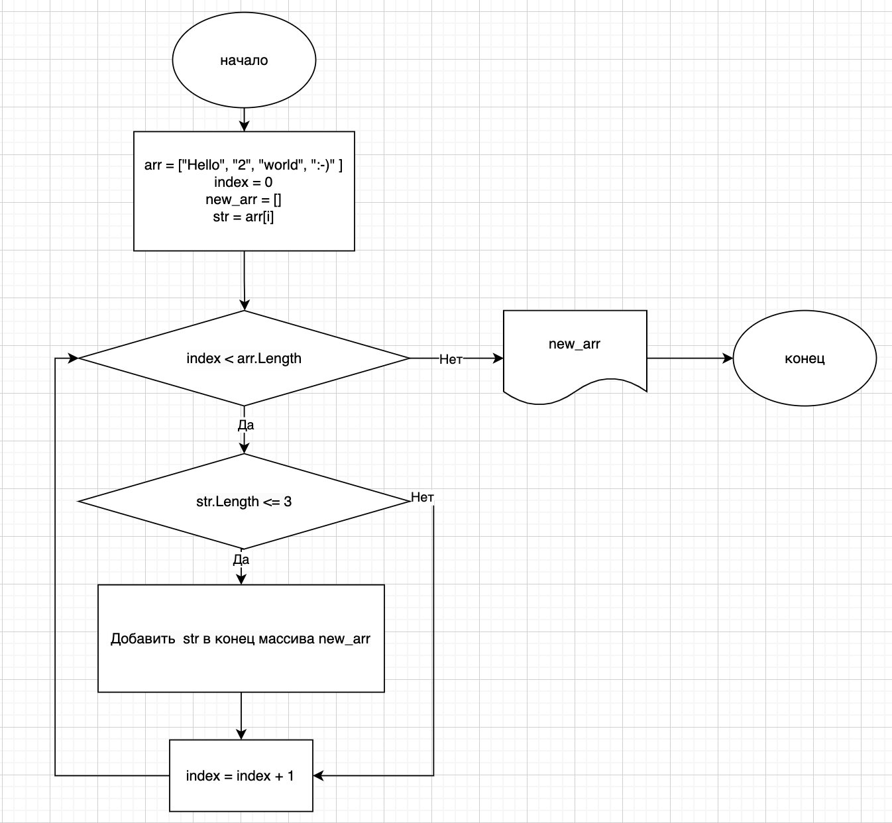

# Решение задачи

## Блок-схема алгоритма

## Описание решения задачи

Инициализировать исходный массив строк arr

Создать новый пустой массив new_arr

Выполнить итерацию каждой строки в массиве 

Создать временную переменную str для хранения строк из массива

Проверить длину каждой строки: если длина меньше или равна 3, добавить ее в новый массив new_arr

Напечатать новый массив, содержащий строки, длина которых меньше или равна 3 символам
